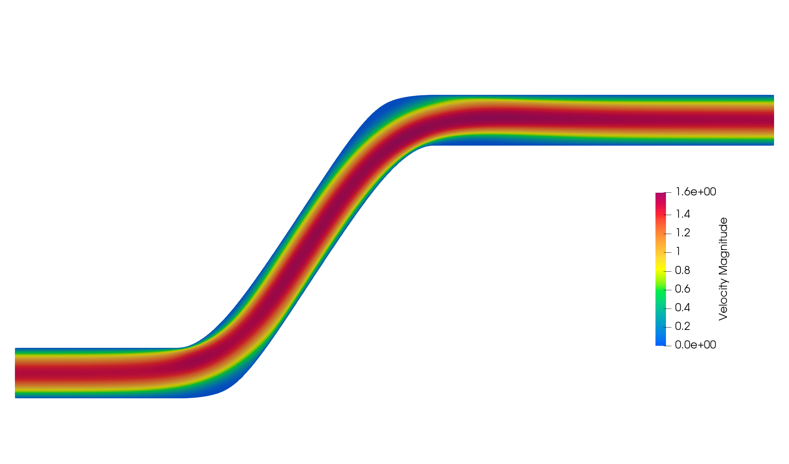
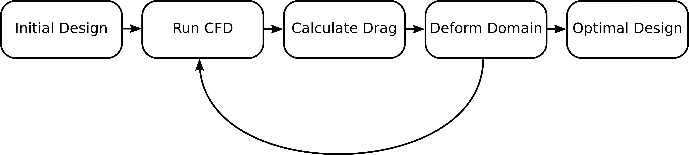
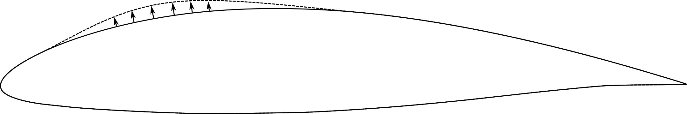

# Fast aero- and hydrodynamic design using automatic differentiation

In this blog post we describe recent developments in open source finite element libraries that allow for the rapid development of solvers and optimisation algorithms in aero-  and hydrodynamics.

## Rapid development of finite element solvers in Firedrake and FEniCS

The development of a modern, efficient finite element solver is an undertaking that requires expertise in many different areas of mathematics and computer science:
on the hand, a competitive solver requires the right choice of discretisation, iterative method and preconditioner, on the other hand, for good performance a thorough understanding of modern hardware and its limits is required to make use of advanced CPU features like AVX512 vectorisation or to create solvers that scale in parallel.
The goal of the Firedrake and FEniCS finite element libraries is to cleanly separate these concerns and provide a flexible framework that enables the implementation of fast solvers for large classes of PDEs without requiring detailed knowledge of quadratures, parallel communication, or high performance linear algebra.

The backbone of these libraries is the _Unified Form Language (UFL)_, a domain specific language for the expression of PDEs in variational form.

We consider a simple example of laminar flow in a two dimensional pipe to demonstrate the use of Firedrake and UFL.

    # pipe_ns.py
    from firedrake import *

    mesh = Mesh("pipe2d.msh")

    degree = 2
    V = VectorFunctionSpace(mesh, "CG", degree)
    Q = FunctionSpace(mesh, "CG", degree-1)
    Z = V * Q

    z = Function(Z)
    test = TestFunction(Z)

In this python code snipped we load the firedrake library, then import a mesh (externally generated in gmsh) and then create two function spaces: one for the velocity and one for the pressure.
We then take the product of these two spaces and generate a `Function` and a `TestFunction` which we will use to express the variational form of the Navier-Stokes equations.
We highlight the simplicity of the choice of discretisation: choosing a higher order element is as easy as changing the `degree` variable.
Alternative discretisations such as a H(div) conformating Raviart-Thomas discretisation for the velocity are as easy as changing the `"CG"` string to `"RT"`; discontinuous pressures can be obtained by using `"DG"`.

Once the function spaces have been created, we define the variational form given by the Navier-Stokes equations:

    # pipe_ns.py continued
    nu = 1./400.
    u, p = split(z)
    v, q = split(test)
    e = nu*inner(grad(u), grad(v))*dx - p*div(v)*dx + inner(dot(grad(u), u), v)*dx + div(u)*q*dx

Note the close to mathematical notation for gradients, divergence and integrals. 
We now set some boundary conditions on the velocity space

    # pipe_ns.py continued
    X = SpatialCoordinate(mesh)
    uin = 6 * as_vector([(1-X[1])*X[1], 0])
    bcs = [DirichletBC(Z.sub(0), Constant((0, 0)), [3, 4]), DirichletBC(Z.sub(0), uin, 1)]

Now we are ready to solve the PDE

    # pipe_ns.py continued
    sp = {
        "mat_type": "aij",
        "pc_type": "lu",
        "pc_factor_mat_solver_type": "mumps"
    }

    solve(e==0, z, bcs=bcs, solver_parameters=sp)

    out = File("u.pvd")
    out.write(z.split()[0])

We specify a few parameters to select the parallel direct solver MUMPS, and then just call `solve(e==0, ...)`.
Note that the Navier-Stokes equations are a non-linear PDE! UFL recognizes this and automatically calculated the Jacobian of `e` and applies Newton's method.
This is particularly useful for complicated, highly non-linear equations, such as those modelling the turbulent kinetic energy `k` or rate of dissipation of turbulence energy `eps` in a k-epsilon turbulence model.

Opening the file `u.pvd` in paraview, we see this velocity plot:

## Derivative based shape optimisation

Typically Computational Fluid Dynamics is not only used to analyse the airflow around a given design, but to provide guidance how a design could be improved.
A typical usecase is the search for wing designs that have low drag while still providing sufficient lift.
The classical workflow of a CFD engineer working on this sort of problem is:

The goal of shape optimisation is to automate this process: one starts with an initial design and and specifies an objective, the algorithm then automatically makes changes to this design until it converges to the optimal shape.

The key mathematical concept that makes this possible is the _shape derivative_. Instead of guessing new designs at every iteration, the shape derivative tells us to first order what the effect of a small change to the shape of the object would be. Such a deformation can be seen in the figure below.

At every iteration this shape derivative is then used to find the deformation of the current shape that reduces the objective as much as possible.

While shape derivatives are an extremely powerful tool, they are usually difficult to derive.
As an example, consider the case of minimizing the dissipated energy in a fluid governed by the (laminar Navier-Stokes equations). The shape derivative is given by

        dLdW = -inner(nu * grad(u) * grad(W), grad(v)) * dx
               - inner(nu * grad(u), grad(v) * grad(W)) * dx
               - inner(v, grad(u)*grad(W)*u) * dx
               + tr(grad(v)*grad(W)) * p * dx
               - tr(grad(u)*grad(W)) * q * dx
               + div(W) * inner(nu * grad(u), grad(v)) * dx
               - div(W) * inner(div(v), p) * dx
               + div(W) * inner(div(u), q) * dx
               + div(W) * inner(v, grad(u)*u) * dx
               + inner(grad(u), grad(u)) * div(W) * dx
               - 2 * inner(grad(u)*grad(W), grad(u)) * dx
	
Once turbulence models are considered the complexity of this derivative is significantly increased again.
We have recently added a feature to the _Unified Form Language_ (UFL) underlying the popular open-source finite element libraries Firedrake and FEniCS that automates this process.
The newly added feature in UFL automatically analyses PDEs and objectives and performs symbolic differentiation with respect to the coordinate field. This is described in detail in _Ham, Mitchell, Paganini and Wechsung (2018)_.
In fact, it allows us to replace the complicated formula above by just one line of code

    dLdW = derivative(L, X, W)

This enables very simple implementation of shape optimisation algorithms.
In fact, a fully functional shape optimisation code can be written in less than 50 lines of code.

    from firedrake import *

    mesh = Mesh("pipe2d.msh")
    coords = mesh.coordinates.vector()
    X = SpatialCoordinate(mesh)

    W = mesh.coordinates.function_space()
    gradJ = Function(W)
    phi, psi = TrialFunction(W), TestFunction(W)
    A_riesz = assemble(inner(grad(phi), grad(psi)) * dx)

    Z = VectorFunctionSpace(mesh, "CG", 2) * FunctionSpace(mesh, "CG", 1)
    z, z_adjoint = Function(Z), Function(Z)
    u, p = split(z)
    test = TestFunction(Z)
    v, q = split(test)

    nu = 1./400.
    e = nu*inner(grad(u), grad(v))*dx - p*div(v)*dx + inner(dot(grad(u), u), v)*dx + div(u)*q*dx
    uin = 6 * as_vector([(1-X[1])*X[1], 0])
    bcs = [DirichletBC(Z.sub(0), 0., [3, 4]), DirichletBC(Z.sub(0), uin, 1)]
    sp = {"pc_type": "lu", "mat_type": "aij", "pc_factor_mat_solver_type": "mumps"}

    J = nu * inner(grad(u), grad(u)) * dx
    volume = Constant(1.) * dx(domain=mesh)
    target_volume = assemble(volume)
    dvol = derivative(volume, X)
    c = 0.1
    L = replace(e, {test: z_adjoint}) + J
    dL = derivative(L, X)

    out = File("u.pvd")
    def solve_state_and_adjoint():
        solve(e==0, z, bcs=bcs, solver_parameters=sp)
        solve(derivative(L, z)==0, z_adjoint, bcs=homogenize(bcs), solver_parameters=sp)
        out.write(z.split()[0])

    solve_state_and_adjoint()
    for i in range(100):
        dJ = assemble(dL).vector() + assemble(dvol).vector() * c * 2  * (assemble(volume)-target_volume)
        solve(A_riesz, gradJ, dJ, bcs=DirichletBC(W, 0, [1, 2, 3]))
        print("i = %3i; J = %.6f; ||dJ|| = %.6f" % (i, assemble(J), norm(grad(gradJ))))
        coords -= 0.5 * gradJ.vector()
        solve_state_and_adjoint()

And we obtain the following shapes throughout the optimisation:

<iframe width="560" height="315" src="https://www.youtube.com/embed/BgVmrgjaxaA" frameborder="0" allow="accelerometer; autoplay; encrypted-media; gyroscope; picture-in-picture" allowfullscreen></iframe>

## More examples

We briefly show two more examples: shape optimisation of a 3D pipe and shape optimisation of an airfoil to maximize aerodynamic efficiency subject to box constraints.

<iframe width="560" height="315" src="https://www.youtube.com/embed/-iwDaVdmFkY" frameborder="0" allow="accelerometer; autoplay; encrypted-media; gyroscope; picture-in-picture" allowfullscreen></iframe>

